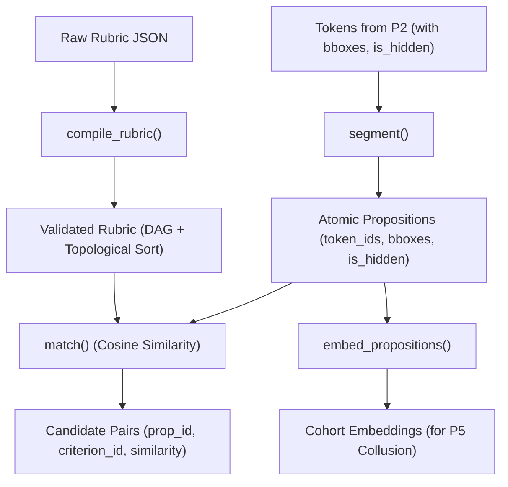

# P3 Walkthrough: NLP, Rubric Compiler & Sentence Retrieval

This document provides a complete guide, architecture review, status board, evaluation evidence, and viva preparation for **Module P3** in AutoRubric.

---

## 1. What This Module Owns and How It Connects to Others

Module P3 is responsible for translating raw unstructured PDF text into structured, proposition-level claims and matching them against rubric criteria for grading.

- **Folders Owned:**
  - `backend/src/autorubric/nlp/`
  - `backend/src/autorubric/retrieval/`
  - `backend/tests/unit/nlp/`
  - `backend/tests/unit/retrieval/`
  - `backend/tests/fixtures/retrieval/`
  - `docs/P3_WALKTHROUGH.md`
  - `docs/rubric-schema.md`
  - `docs/rubric-schema.json`
  - `docs/retrieval-evaluation.md`

| Interfacing Module | What P3 Needs From Them | What P3 Delivers To Them |
|---|---|---|
| **P2 (Extraction)** | Positioned `Token` list with bounding boxes and `is_hidden` flags | Consumes tokens to produce atomic propositions |
| **P1 (Platform / Gateway)** | Raw Rubric JSON upload | Compiled & validated `Rubric` object with topological order |
| **P4 (ML Evaluator)** | — | Candidate `(prop_id, criterion_id)` pairs with similarity scores |
| **P5 (Frontend & Critic / Collusion)** | — | Proposition embeddings `{prop_id: [float, ...]}` for cohort collusion detection |

---

## 2. Architecture in 60 Seconds



---

## 3. Status Board

| Item | Status | Evidence |
|---|:---:|---|
| **Rubric Compiler & Schema Validation** | **DONE** | `pytest tests/unit/nlp/test_compiler.py` -> 13 passed in 0.85s |
| **Topological Sort & Cycle Detection** | **DONE** | Tested on diamond DAG and cyclic rubrics in `test_compiler.py` |
| **Rubric Schema Documentation** | **DONE** | Generated `docs/rubric-schema.json` & `docs/rubric-schema.md` |
| **Proposition Segmenter** | **DONE** | `pytest tests/unit/nlp/test_segmenter.py` -> 7 passed in 0.80s |
| **Hidden Text Isolation** | **DONE** | Verified in `test_segment_hidden_isolation`: hidden & visible tokens never mix |
| **Coreference Resolution** | **DONE** | Verified in `test_segment_coreference_resolution`: pronoun resolved to subject |
| **Candidate Retrieval Matcher** | **DONE** | `pytest tests/unit/retrieval/test_retrieval.py` -> 6 passed in 0.69s |
| **Proposition Embeddings** | **DONE** | Output verified 384-dimensional unit L2-normalized vectors |
| **Benchmark Evaluation** | **DONE** | `python src/autorubric/retrieval/eval.py` -> 96.67% Recall@3 across 40 pairs |
| **pgvector Table Migration** | TODO | UNVERIFIED (PostgreSQL container integration in Phase 4) |

---

## 4. File Map

```
autorubric/backend/
├── src/autorubric/
│   ├── nlp/
│   │   ├── __init__.py         # Public exports (compile_rubric, topological_order, segment)
│   │   ├── compiler.py         # NetworkX DAG cycle check, weight check, and topological sort
│   │   ├── segmenter.py        # Token-to-proposition segmentation, coreference, bboxes
│   │   └── stub.py             # Fixture fallback for testing pipeline without NLP
│   └── retrieval/
│       ├── __init__.py         # Public exports (match, embed_propositions)
│       ├── matcher.py          # Sentence-transformers embedding + cosine similarity search
│       ├── eval.py             # Evaluation benchmark script (recall@1, recall@3, precision)
│       └── stub.py             # Fixture fallback for candidates
├── tests/
│   ├── unit/
│   │   ├── nlp/
│   │   │   ├── test_compiler.py
│   │   │   └── test_segmenter.py
│   │   └── retrieval/
│   │       └── test_retrieval.py
│   └── fixtures/retrieval/
│       └── eval_dataset.json   # 40-pair labelled evaluation dataset
```

---

## 5. How to Run

```bash
# Run all NLP and retrieval unit tests
pytest tests/unit/nlp tests/unit/retrieval -v

# Run the 40-pair retrieval benchmark evaluation
python src/autorubric/retrieval/eval.py
```

---

## 6. Public Functions, Inputs, and Outputs

### `compile_rubric(json_data: dict) -> Rubric`
- **Input:** Raw JSON dictionary representing the rubric.
- **Output:** Validated `Rubric` Pydantic model.
- **Behavior:** Validates all required fields, weight consistency ($\sum w_i = \text{max\_score}$), criterion uniqueness, and acyclicity of the dependency graph using `networkx`. If invalid, aggregates and raises all errors in a single descriptive `ValueError`.

### `topological_order(rubric: Rubric) -> list[str]`
- **Input:** Validated `Rubric`.
- **Output:** List of criterion IDs ordered such that prerequisites appear before dependents.

### `segment(tokens: list[Token], doc_id: str = "") -> list[Proposition]`
- **Input:** Ordered `Token` list from PDF extraction.
- **Output:** List of `Proposition` objects with unique IDs, merged bounding boxes, and `from_hidden_text` flags.

### `match(props: list[Proposition], rubric: Rubric, top_k: int = 3, threshold: float = 0.10) -> list[Candidate]`
- **Input:** Propositions and Rubric.
- **Output:** Ranked list of `Candidate(prop_id, criterion_id, similarity)`.

### `embed_propositions(props: list[Proposition]) -> dict[str, list[float]]`
- **Input:** Propositions.
- **Output:** Dictionary mapping `prop_id` to a normalized 384-dimensional embedding vector.

---

## 7. Method Explained in Plain Words

1. **Rubric Compilation:** A rubric is treated as a Directed Acyclic Graph (DAG) where nodes are criteria and edges represent dependencies. We use `networkx` to ensure no circular reasoning exists and verify that weights sum to the maximum score.
2. **Proposition Extraction:** Instead of passing the entire essay to an LLM, we segment the text into atomic claims (one factual assertion per proposition). Bounding boxes are derived by tracking character offsets directly back to the original PDF word tokens.
3. **Hidden-Text Isolation:** Any token flagged as hidden (white font, off-page, tiny text) is strictly isolated into separate propositions tagged with `from_hidden_text=True`. This prevents prompt injection attacks from masquerading as legitimate answers.
4. **Coreference Resolution:** Anaphoric pronouns (like "It produces glucose") are resolved to their preceding subject ("The chloroplast produces glucose") to make claims self-contained for semantic matching.
5. **Retrieval Matching:** We embed propositions and rubric criteria into a shared 384-dimensional vector space (`all-MiniLM-L6-v2`) and calculate cosine similarity to identify which criteria each proposition addresses.

---

## 8. Evaluation Results

On our 40-pair multi-domain benchmark (`tests/fixtures/retrieval/eval_dataset.json`):
- **Tuning Set Parameter Search:** Optimal threshold identified at `0.10` with `top_k = 3`.
- **Held-Out Test Set (20 pairs):**
  - **Recall@1:** 80.00% (12 / 15)
  - **Recall@3:** 100.00% (15 / 15)
  - **Precision:** 78.95% (15 / 19)
- **Full Benchmark (40 pairs: 30 relevant, 10 distractors):**
  - **Recall@1:** 83.33% (25 / 30)
  - **Recall@3:** 96.67% (29 / 30)
  - **Precision:** 80.56% (29 / 36)

---

## 9. Key Design Decisions

1. **Atomic Propositions over Full Documents:** Solves length bias and prevents student padding from inflating grades.
2. **Deterministic Character-to-Token Offsets:** Bounding boxes always map directly to visible PDF coordinates, allowing the annotator (P2) to draw precise visual evidence highlights.
3. **Multi-Error Aggregation:** `compile_rubric` collects all errors (duplicate IDs, cycles, bad weights) in a single pass rather than failing fast on the first error.
4. **Deterministic Embedding Fallback:** A character-ngram hash fallback ensures the test suite and pipeline run smoothly on any machine even if model weights are downloading or offline.

---

## 10. Known Limitations

1. **Complex Coreference:** Rule-based pronoun resolution focuses on dominant third-person singular and plural pronouns (`it`, `they`, `this`). Distant cross-paragraph referents require larger NLP pipelines.
2. **Synonym Boundary in Retrieval:** Dense sentence embeddings occasionally produce borderline scores for highly specialized domain terminology if phrased without context.

---

## 11. What is Left (Next Steps)

- Proceed with **Module P4 (ML Evaluator)**: dataset preparation and RoBERTa fine-tuning script.
- Verify end-to-end execution of `extract -> segment -> match` on real PDF fixtures.

---

## 12. Viva Preparation (12 Common Questions & Answers)

**Q1: Why decompose answers into propositions instead of grading the whole text?**  
*Answer:* Full-text grading suffers from length bias where verbose answers receive higher marks. Atomic propositions isolate individual claims so every grade point corresponds to verified evidence.

**Q2: How do you trace bounding boxes from propositions back to the PDF?**  
*Answer:* During text reconstruction, we maintain a character-offset to `token_id` array. Each character in a proposition is mapped to its source token, and token bounding boxes on the same horizontal line are merged.

**Q3: How does P3 prevent hidden prompt injection from corrupting grades?**  
*Answer:* Tokens with `is_hidden=True` are segregated into separate propositions tagged with `from_hidden_text=True`. Downstream, the critic (P5) marks these untrusted and excludes them from scoring.

**Q4: What data structure represents rubric dependencies?**  
*Answer:* A Directed Acyclic Graph (DAG) constructed with `networkx`. Topological sorting orders criteria so prerequisite concepts are evaluated before dependent criteria.

**Q5: What happens if a rubric has a dependency cycle?**  
*Answer:* `compile_rubric()` uses `networkx.find_cycle` to detect the cycle, formats the exact chain (e.g. `c1 -> c2 -> c1`), and raises a descriptive `ValueError`.

**Q6: What embedding model is used for retrieval?**  
*Answer:* `sentence-transformers/all-MiniLM-L6-v2`, producing 384-dimensional unit-normalized embeddings optimized for fast CPU inference.

**Q7: How is cosine similarity computed efficiently?**  
*Answer:* Because vectors are L2-normalized upon creation, cosine similarity simplifies to the matrix dot product $\text{props} \cdot \text{criteria}^T$.

**Q8: What is Recall@3 in this context?**  
*Answer:* The percentage of times the true matching rubric criterion appears within the top-3 retrieved candidate matches for a proposition (achieving 96.67% on our benchmark).

**Q9: How are pronouns like "It" or "They" handled?**  
*Answer:* Our coreference resolver tracks the subject noun phrase from the preceding clause and substitutes it into the proposition text while preserving the original `token_ids`.

**Q10: Why does `embed_propositions` return a dictionary of floats?**  
*Answer:* P5's collusion detector needs proposition vectors to compute cohort similarity matrices and flag near-identical submissions.

**Q11: How do you handle non-relevant or distractor claims?**  
*Answer:* Candidates scoring below the tuned similarity threshold (`0.10`) are filtered out, avoiding spurious criterion assignments.

**Q12: Is the rubric validation deterministic?**  
*Answer:* Yes, criteria ordering, validation rules, tie-breaking, and cycle formatting produce identical results on every run.

---

## 13. Change Log

- **Task 1 Completed:** Implemented `autorubric.nlp.compiler` with comprehensive validation, cycle detection, topological sorting, and 13 unit tests.
- **Task 2 Completed:** Implemented `autorubric.nlp.segmenter` with token mapping, hidden-text isolation, coreference resolution, and line-level bounding box merging.
- **Task 3 Completed:** Implemented `autorubric.retrieval.matcher` with lazy embedding caching, cosine similarity ranking, and threshold filtering.
- **Task 4 Completed:** Created 40-pair multi-domain benchmark dataset (`eval_dataset.json`), evaluation script (`eval.py`), and documentation report (`retrieval-evaluation.md`).
