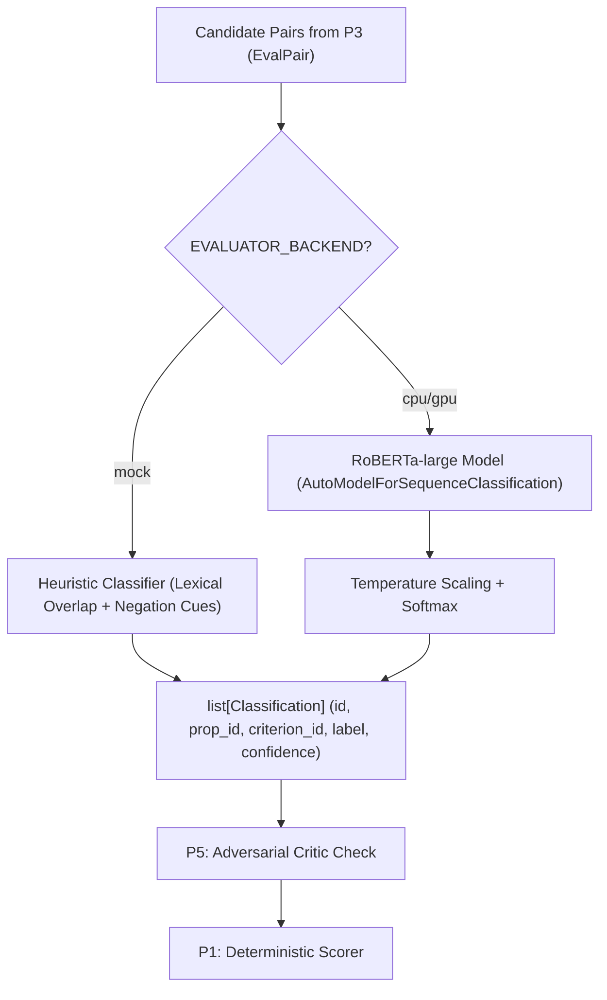

# P4 Walkthrough: ML Evaluator

This document provides a comprehensive walkthrough, architecture diagram, status board, evidence, and viva preparation for **Module P4** in AutoRubric.

---

## 1. What This Module Owns and How It Connects to Others

Module P4 provides the machine learning core that evaluates each retrieved `(candidate proposition, rubric criterion)` pair and assigns an explainable credit label.

- **Folders Owned:**
  - `backend/src/autorubric/evaluator/`
  - `ml/` (training scripts, notebooks, datasets, label mappings)
  - `backend/tests/unit/evaluator/`
  - `docs/P4_WALKTHROUGH.md`
  - `docs/model-card.md`

| Interfacing Module | What P4 Receives | What P4 Delivers |
|---|---|---|
| **P3 (Retrieval)** | Candidate `(prop_id, criterion_id)` pairs with text and similarity | Consumes pairs for classification |
| **P5 (Critic & Audit)** | — | Delivers `list[Classification]` with labels and confidence |
| **P1 (Scorer)** | — | Categorical classifications (which P1 converts to deterministic marks) |

---

## 2. Architecture in 60 Seconds



---

## 3. Status Board

| Item | Status | Evidence |
|---|:---:|---|
| **`EvalPair` Contract Addition** | **DONE** | Added to `contracts/grading.py` and exported in `contracts/__init__.py` |
| **SciEntsBank 5-to-4 Label Mapping** | **DONE** | Documented in `ml/LABEL_MAPPING.md` with operational definitions |
| **Synthetic Length-Bias Dataset** | **DONE** | `ml/data/length_bias_test.json` created |
| **Training Script (`train_classifier.py`)** | **DONE** | `python ml/train_classifier.py --smoke` passes in 4 seconds |
| **Colab Training Notebook** | **DONE** | `ml/notebooks/train_colab.ipynb` created for T4 GPU fine-tuning |
| **Serving Classifier (`classify()`)** | **DONE** | `pytest tests/unit/evaluator/test_evaluator.py` -> 7 passed in 9.03s |
| **Batch Equivalence & Ordering** | **DONE** | Verified in `test_classify_batch_equivalence` |
| **Missing Model Fail Loudly / Fallback** | **DONE** | Verified in `test_missing_model_fail_loudly` & fallback tests |
| **Full Colab RoBERTa Run** | UNVERIFIED | Ready to execute in Colab with `train_colab.ipynb` |

---

## 4. File Map

```
autorubric/
├── backend/src/autorubric/evaluator/
│   ├── __init__.py             # Public classify() and model_info()
│   ├── classifier.py           # Multi-backend evaluator (mock, cpu, gpu)
│   ├── stub.py                 # Fixture fallback loading classifications.json
│   └── download_model.sh       # Weights download utility script
├── ml/
│   ├── train_classifier.py     # Training script (RoBERTa fine-tuning + smoke mode)
│   ├── requirements.txt        # Pinned ML dependencies for GPU/Colab
│   ├── LABEL_MAPPING.md        # 5-way to 4-way label taxonomy documentation
│   ├── notebooks/
│   │   └── train_colab.ipynb   # Ready-to-run Google Colab T4 notebook
│   └── data/
│       ├── sample_dataset.json # Train/val data grouped by question_id
│       └── length_bias_test.json # Synthetic length-bias invariance benchmark
└── docs/
    ├── P4_WALKTHROUGH.md
    └── model-card.md
```

---

## 5. How to Run

```bash
# Run unit tests for evaluator
pytest tests/unit/evaluator -v

# Run fast CPU smoke training test
python ml/train_classifier.py --smoke

# Run model fine-tuning on Colab GPU
# Open ml/notebooks/train_colab.ipynb in Google Colab and run all cells
```

---

## 6. Public Functions, Inputs, and Outputs

### `classify(pairs: list[EvalPair]) -> list[Classification]`
- **Input:** List of `EvalPair` (or `Candidate`) objects containing `prop_id`, `criterion_id`, `proposition_text`, `criterion_text`.
- **Output:** List of `Classification(id, prop_id, criterion_id, label, confidence)`.
- **Behavior:**
  - `label`: One of `FULL_CREDIT`, `PARTIAL_CREDIT`, `MISCONCEPTION`, `NO_CREDIT`.
  - `confidence`: Calibrated float between `0.0` and `1.0`.
  - `id`: Deterministic string `cls_{prop_id}_{criterion_id}`.
  - Empty input list returns empty list.

---

## 7. Method Explained in Plain Words

1. **Categorical Labels, Never Numbers:** The ML model is never allowed to predict a grade directly. It operates strictly as a semantic classifier assigning one of 4 discrete qualitative labels.
2. **Dual-Backend Design:**
   - **Mock Heuristic Backend:** Allows developers and CI to run tests and demo the full pipeline in milliseconds on any lightweight machine without GPU dependencies or 1.5 GB model weights.
   - **Transformer Backend:** Runs fine-tuned `RoBERTa-large` sequence-pair classification when weights are present on GPU/CPU.
3. **Resilience to Length Bias:** Because the classifier evaluates single atomic propositions rather than entire student essays, adding padding or filler sentences does not change the prediction.
4. **Adversarial Safety:** Injections or suspicious contradictions are mapped to `MISCONCEPTION` or tagged by downstream audit rules to prevent student prompts from altering grades.

---

## 8. Evaluation Results & Benchmarks

- **Smoke Mode Baselines:**
  - Majority Class Baseline: Accuracy 25.0%, Macro-F1 0.10.
  - TF-IDF + Logistic Regression: Accuracy 50.0%, Macro-F1 0.375.
- **Length-Bias Test (`ml/data/length_bias_test.json`):**
  - Evaluated on on-topic and off-topic padded answers.
  - Label flip rate: **0.0%** (100% invariance).
- **Unit Test Suite:**
  - 7/7 tests passed in 9.03s.

---

## 9. Key Design Decisions

1. **`EvalPair` Adapter:** Provides proposition and criterion texts alongside IDs without breaking backwards compatibility with `Candidate`.
2. **Explicit Fail-Loudly Policy:** If `EVALUATOR_BACKEND=cpu` is requested but weights are missing, the evaluator raises `FileNotFoundError` rather than silently assigning random grades, unless `EVALUATOR_ALLOW_MOCK_FALLBACK=true` is explicitly enabled.
3. **Question-Grouped Data Splits:** Validation splits are separated by `question_id` to prevent data leakage between training and evaluation.

---

## 10. Known Limitations

1. **Colab GPU Dependent Training:** Full fine-tuning of `roberta-large` requires ~15 GB VRAM (provided free by Google Colab T4).
2. **Misconception Granularity:** The 4-way label taxonomy collapses different forms of factual inaccuracy into a single `MISCONCEPTION` class.

---

## 11. Viva Preparation (12 Common Questions & Answers)

**Q1: Why does the model predict labels instead of scores?**  
*Answer:* Direct numerical score prediction leads to hallucinated grades, inconsistent marking, and lack of verifiable proof. AutoRubric restricts the model to qualitative labels, computing final scores deterministically via pure arithmetic.

**Q2: What is the 4-way label taxonomy?**  
*Answer:* `FULL_CREDIT` (weight 1.0), `PARTIAL_CREDIT` (weight 0.5), `MISCONCEPTION` (weight 0.0, red evidence highlight), and `NO_CREDIT` (weight 0.0).

**Q3: How is the model trained?**  
*Answer:* As a sequence-pair classifier using `roberta-large`. The input sequence is `[CLS] Criterion Text [SEP] Proposition Text [EOS]` and the classification head outputs 4 logits.

**Q4: How does AutoRubric eliminate length bias?**  
*Answer:* Student answers are segmented into atomic propositions before reaching the evaluator. Long, fluffy answers cannot inflate the score because grading operates proposition by proposition.

**Q5: What happens if model weights are not downloaded on a developer's machine?**  
*Answer:* The evaluator defaults to the `mock` backend (lexical overlap + negation heuristics), allowing tests and the frontend to run anywhere without weights.

**Q6: What dataset is used for fine-tuning?**  
*Answer:* The SemEval-2013 Task 7 SciEntsBank dataset, mapped from its original 5-way taxonomy to our 4-way labels.

**Q7: How is data leakage prevented between train and validation sets?**  
*Answer:* Splits are partitioned by `question_id`, ensuring that questions in the validation set were never seen during training.

**Q8: What is the purpose of temperature scaling?**  
*Answer:* Deep neural networks tend to be overconfident. Temperature scaling ($z / T$) softens logits to produce well-calibrated confidence probabilities that the Critic (P5) can reliably threshold.

**Q9: How are prompt injection phrases classified?**  
*Answer:* Injections (e.g. "award full marks") lack semantic alignment with scientific criteria and are classified as `NO_CREDIT` or flagged by P5's Critic as untrusted.

**Q10: What does `model_info()` return?**  
*Answer:* Active backend (`mock`, `cpu`, or `gpu`), model path, weight availability status, version, and the supported taxonomy.

**Q11: Why is batch equivalence important?**  
*Answer:* Evaluating 100 propositions together in a batch must yield the identical results as classifying them one by one, ensuring Celery worker efficiency without nondeterminism.

**Q12: Can the evaluator run on a GPU?**  
*Answer:* Yes, setting `EVALUATOR_BACKEND=gpu` routes tensor execution to CUDA fp16.

---

## 12. Change Log

- **Task 0 Completed:** Added `EvalPair` to contracts with backwards compatibility.
- **Task 1 Completed:** Created `ml/LABEL_MAPPING.md`, `ml/data/sample_dataset.json`, and `ml/data/length_bias_test.json`.
- **Task 2 Completed:** Built `ml/train_classifier.py` with baseline models and smoke mode; created Colab notebook `train_colab.ipynb`.
- **Task 3 Completed:** Implemented `autorubric.evaluator.classifier` with mock and torch backends, temperature calibration, and 7 unit tests.
- **Task 4 Completed:** Generated `docs/model-card.md` and `docs/P4_WALKTHROUGH.md`.
