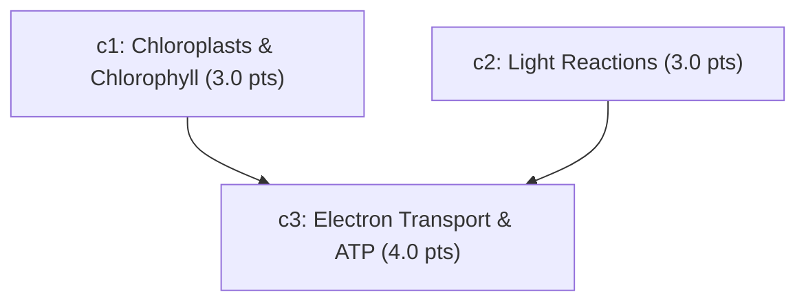

# Rubric Schema Documentation

AutoRubric uses a structured JSON rubric schema to evaluate student submissions deterministically. Each rubric defines a set of evaluation criteria, weights, dependencies (Directed Acyclic Graph), and a credit mapping.

## Schema Overview

- **`id`** (`string`): Unique identifier for the rubric (e.g., `"r-bio-photosynthesis"`).
- **`title`** (`string`): Human-readable title of the assignment or question.
- **`max_score`** (`float`): Maximum achievable score. Must equal the sum of all criterion weights ($\sum w_i$).
- **`credit_map`** (`object`): Multipliers applied to each categorical classification label:
  - `FULL_CREDIT` (default: `1.0`)
  - `PARTIAL_CREDIT` (default: `0.5`)
  - `NO_CREDIT` (default: `0.0`)
  - `MISCONCEPTION` (default: `0.0`)
- **`criteria`** (`array` of Criterion objects):
  - **`id`** (`string`): Unique identifier within the rubric (e.g., `"c1"`, `"c2"`).
  - **`description`** (`string`): Target concept or expected claim against which student propositions are matched.
  - **`weight`** (`float`): Point value assigned to this criterion ($w_i > 0$).
  - **`depends_on`** (`array` of `string`): Criterion IDs that must be satisfied before full marks can be awarded for this criterion (DAG structure).

---

## Example 1: Standard Independent Rubric

A flat 3-criterion biology question where each criterion is evaluated independently:

```json
{
  "id": "rubric-bio-101",
  "title": "Plant Cell Structure & Photosynthesis",
  "max_score": 10.0,
  "credit_map": {
    "FULL_CREDIT": 1.0,
    "PARTIAL_CREDIT": 0.5,
    "NO_CREDIT": 0.0,
    "MISCONCEPTION": 0.0
  },
  "criteria": [
    {
      "id": "c1",
      "description": "Mentions that chloroplasts contain chlorophyll to absorb light energy.",
      "weight": 4.0,
      "depends_on": []
    },
    {
      "id": "c2",
      "description": "Identifies water and carbon dioxide as the primary reactants.",
      "weight": 3.0,
      "depends_on": []
    },
    {
      "id": "c3",
      "description": "Explains that glucose and oxygen are the products of the reaction.",
      "weight": 3.0,
      "depends_on": []
    }
  ]
}
```

---

## Example 2: DAG Rubric with Dependencies

A layered rubric where understanding the mechanism (c3) depends on first establishing the core concepts (c1 and c2):



```json
{
  "id": "rubric-bio-dag-advanced",
  "title": "Advanced Light Reaction Pathway",
  "max_score": 10.0,
  "credit_map": {
    "FULL_CREDIT": 1.0,
    "PARTIAL_CREDIT": 0.5,
    "NO_CREDIT": 0.0,
    "MISCONCEPTION": 0.0
  },
  "criteria": [
    {
      "id": "c1",
      "description": "States that chlorophyll in thylakoid membranes captures photons.",
      "weight": 3.0,
      "depends_on": []
    },
    {
      "id": "c2",
      "description": "Explains water photolysis releasing protons, electrons, and oxygen gas.",
      "weight": 3.0,
      "depends_on": []
    },
    {
      "id": "c3",
      "description": "Synthesizes ATP and NADPH via proton gradient across the thylakoid membrane.",
      "weight": 4.0,
      "depends_on": ["c1", "c2"]
    }
  ]
}
```

### Dependency Rules:
- If prerequisite criteria `c1` or `c2` receive `NO_CREDIT`, the dependent criterion `c3` is capped (as defined in the platform scoring engine).
- The compiler validates that the dependency graph contains no cycles and no dangling references.
